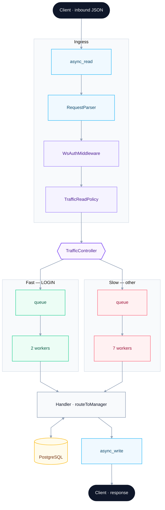

# Architecture — chat server

How a WebSocket frame becomes a database write and a response. Product overview and setup: [README.md](README.md).

The chat server keeps **I/O light on Asio network threads** and runs **business logic + DB on worker threads**.

## Request path

_Ingress runs on Boost.Asio `io_context` network threads. Lane titles encode LOGIN vs other traffic — edge labels are omitted to keep the layout clean._

**Stages**

1. **Accept / session** — `Network` accepts the WebSocket, assigns a `sessionId`, sends `SESSION_INIT`, starts `readWs` (`Network.cpp`).
2. **Ingress pipeline** — each frame runs `RequestPipeline::run`: parse JSON → `WsAuthMiddleware` → ordered-read gate → then `TrafficController::route` (`RequestPipeline.cpp`).
3. **Lanes** — `TrafficPolicy` chooses a queue (`TrafficPolicy.h`):
   - **Fast:** `LOGIN_REQUEST` (2 worker threads)
   - **Slow:** everything else (7 worker threads), including `MESSAGE_REQUEST` / `FIRST_MESSAGE_REQUEST`
4. **Dispatch** — workers `pop` FIFO from `SharedContext`, call `Handler::routeToManager`, then schedule `NetworkAction`s back onto the `io_context` for `async_write` (`Dispatcher.cpp`).
5. **Writes** — one in-flight write per client; payloads queue until the previous `async_write` finishes (`writeWs`).

## JWT on the path

| Step | Where | What |
|------|--------|------|
| Anonymous | `LOGIN_REQUEST` / `CREATE_REQUEST` | No token; `WsAuthMiddleware` lets them through |
| Issue | `Handler` after successful login/create/auth | `Auth::issueJWT` → `JWT_SECRET` (`getenv`) |
| Verify | Every other request on ingress | `WsAuthMiddleware` → `Auth::verify` before the request is queued |
| Media | Signed URL tokens | Same `JWT_SECRET` on `chat_server` and `media_server` |

`sessionId` must match the connection; mismatch closes the session with `SESSION_MISMATCH`.

## Ordering (send path)

TCP and a **single outstanding `async_read` per client** preserve request order into the shared queues. Worker **completion** order is not guaranteed across threads.

For types marked `requires_ordering` (`MESSAGE_REQUEST`, `FIRST_MESSAGE_REQUEST`), `TrafficReadPolicy` + a per-client ordered gate ensure the next ordered request for that client is not dispatched until the previous one’s response path releases the gate (`RELEASE_ORDERED_GATE`). Unordered types (e.g. typing) can still progress without waiting on a slow insert.

Deep dive: [Ordering Messages in a Concurrent C++ WebSocket Server](https://davidzdravkovic.github.io/posts/message-ordering.html).

## Protocol (high level)

Client and server talk **JSON over one WebSocket**. Typical flow:

1. Connect → server sends `SESSION_INIT` with `sessionId`
2. `LOGIN_REQUEST` / `CREATE_REQUEST` (no token) → JWT on success
3. Later messages include session id + JWT
4. Live traffic examples: `MESSAGE_REQUEST`, `FETCH_MESSAGES_REQUEST`, `TYPING_REQUEST`, `SEEN_REQUEST`, `REACTION_REQUEST`, media upload/finalize requests

Shared enums: `chat_room_server/common/RequestType.h`, `ResponseType.h`
