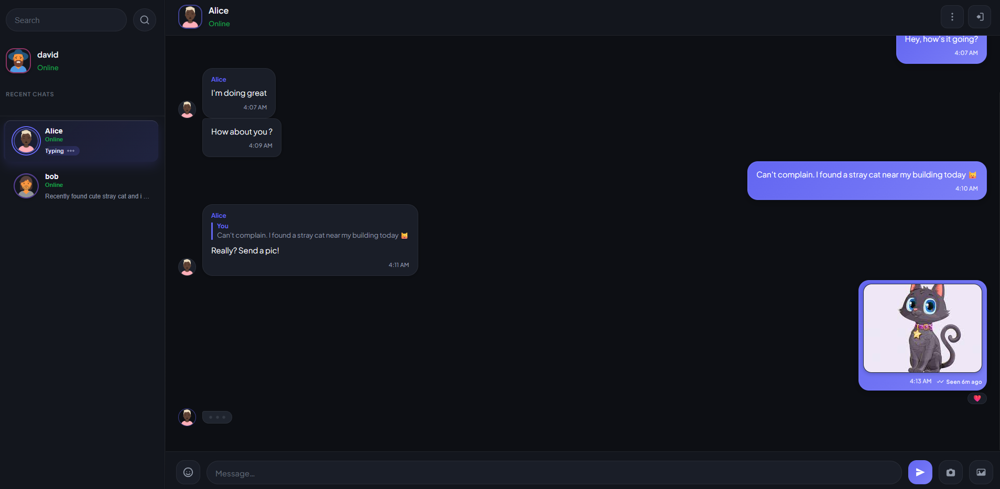

<p align="center">
  
</p>

<h1 align="center">ChatMe</h1>

<p align="center">
  Messaging platform for <strong>1-to-1 private chat</strong>
</p>

<p align="center">
  <a href="https://connectroom.duckdns.org"><strong>Live app → connectroom.duckdns.org</strong></a>
</p>

## Screenshot

<p align="center">
  
</p>

---

## Why this project exists

The main purpose of this project was to build a **real product for real users**.

The second goal was to develop a deeper understanding of server-side networking by building a **custom C++ WebSocket backend** (Boost.Asio / Boost.Beast) without relying on a high-level framework. That let me own the network layer: connections, message flow, and how a server handles concurrent real-time traffic.

---

## Features

**Accounts**
- User registration and login

**Messaging**
- 1-to-1 private chats
- Real-time text messaging
- Reply to a message
- Message pagination and in-chat search

**Media**
- Image messages
- Profile pictures

**Live signals**
- Typing indicators
- Read receipts
- Emoji reactions
- Online and last-active presence

**Discovery**
- Recent chats
- User search

---

## Tech stack

| Layer | Technologies |
|--------|----------------|
| Frontend | React 18 · Vite · Capacitor 8 · JavaScript |
| Backend | C++17 · Boost.Asio/Beast (WebSockets) · cpp-httplib (media) |
| Data | PostgreSQL · libpqxx |
| Auth | JWT · Argon2id (libsodium) |
| Deploy | Linux VPS · nginx · systemd |

---

## Architecture (overview)

### Deployment shape

```text
Browser / Capacitor
        │
        ▼
   nginx (HTTPS)
     ├── static React build
     ├── /ws     → C++ chat server  (127.0.0.1:12346)
     └── /media/ → media service    (:8081)
                      │
                 PostgreSQL
```

**Project structure**

- `chat_room_server/` — C++ WebSocket server  
- `reactChatRoom/` — React + Capacitor client  
- `media_storage/` — media HTTP service  

### Concurrency model (chat server)

- **Network threads** (Boost.Asio `io_context`) only do I/O and a light ingress pipeline: parse, JWT verify, ordering gate.
- **Worker threads** run business logic and PostgreSQL work, then hand responses back to the `io_context` for writing.
- Requests are split into a **fast queue** (`LOGIN_REQUEST`, 2 workers) and a **slow queue** (everything else, 7 workers).
- Send-order between two users is enforced per client for message types, not by luck of thread scheduling.

**Full request path, JWT flow, ordering rules, and protocol:** [ARCHITECTURE.md](ARCHITECTURE.md)

---

## Quick start (local development)

Exact dependency versions and OS paths vary. Use this as the map; adjust for your machine.

### Prerequisites

#### API server (`chat_room_server`)

- C++17 toolchain
- CMake 3.20+
- Dependencies:
  - Boost 1.89.0
  - PostgreSQL 17.5
  - libpqxx 7.10.1
  - OpenSSL 3.6.2
  - libsodium 1.0.20
  - jwt-cpp 0.7.2 (Windows) / 0.7.1 (Linux/BSD)
  - nlohmann/json 3.11.3

#### Database

- PostgreSQL 17.5

#### Client

- React + Node.js 18+

#### Media server

- C++17 toolchain
- CMake 3.20+
- OpenSSL 3.0.17
- cpp-httplib (vendored locally in the project tree)

> **Note:** The versions listed above are the versions used and tested with this project. They are recommended for compatibility but are not strict version requirements.

### Database

This project does not use a migration runner. New developers apply the committed baseline schema once to an empty database.

**Schema source of truth:** `chat_room_server/db/schema.sql`  
**Connection config:** `chat_room_server/Config/DataBase.json` (defaults below)

#### Bootstrap (empty database)

```bash
# 1. Create role + database (psql as a superuser, e.g. postgres)
psql -U postgres -c "CREATE USER db_user WITH PASSWORD 'db_password';"
psql -U postgres -c "CREATE DATABASE chatroom_db OWNER db_user;"

# 2. Apply schema
psql -U db_user -d chatroom_db -f chat_room_server/db/schema.sql
```

If the role or database already exists, skip step 1 and only run the `psql -f` command.

The server reads DB **host / port / name** from `Config/DataBase.json`
and DB **username / password** from environment variables `db_user` and
`db_password`. Those must match the PostgreSQL role created above.


#### Auth environment

| Variable | Required | Purpose |
|----------|----------|---------|
| `JWT_SECRET` | Yes (for real JWT builds) | Shared secret for HS256 login/media tokens (`getenv`) |
| `db_user` / `db_password` | Yes | PostgreSQL role credentials |
| `CHAT_INSECURE_DEV_AUTH` | No | Only when built **without** `CHAT_ENABLE_JWT`: allows `dev:…` tokens without real JWT |

With presets that set `CHAT_ENABLE_JWT=ON` (e.g. `msys2-mingw64-local`), set `JWT_SECRET` and ignore `CHAT_INSECURE_DEV_AUTH` — that flag is not compiled into JWT builds.

`chat_server` and `media_server` both read `JWT_SECRET` from the environment
and must use the **same** value.

## Build

> `Note`: Before configuring and building, make sure all required dependencies are installed and discoverable by CMake.

### API server

```bash 
# During CMake configuration: 
# - Linux/BSD: jwt-cpp is fetched automatically when JWT support is enabled.
# - All platforms: nlohmann/json is downloaded into third_party/.
cd chat_room_server
cmake -S . -B build
cmake --build build
cd build
.\chat_server
```


### Media server

```bash 
cd media_storage
cmake -S . -B build
cmake --build build
cd build
.\media_server
```

### Client

```bash
cd reactChatRoom
npm install
npm run dev
```

## Run

The chat server reads secrets from the environment at startup and **exits with `Missing env var: …`** if they are not set. Export them in the same shell that launches the binary.

**Linux/macOS**

```bash
export db_user=db_user
export db_password=db_password
export JWT_SECRET="$(openssl rand -hex 32)"

cd chat_room_server && ./build/chat_server
```

**Windows (PowerShell)**

```powershell
$env:db_user = "db_user"
$env:db_password = "db_password"
$env:JWT_SECRET = "long-random-value"

cd chat_room_server
.\build\chat_server.exe
```

Run the chat server from a directory that contains `Config/` (it resolves `Config/DataBase.json` and `Config/Network.json` relative to the executable or the current directory).

The media server needs the **same** `JWT_SECRET`, or `MEDIA_ALLOW_UNSIGNED=1` for local dev without signed URLs:

```bash
export JWT_SECRET=same-value-as-chat-server   # or: export MEDIA_ALLOW_UNSIGNED=1
cd media_storage && ./build/media_server
```

## License

Personal portfolio project. Ask before reusing commercially.
